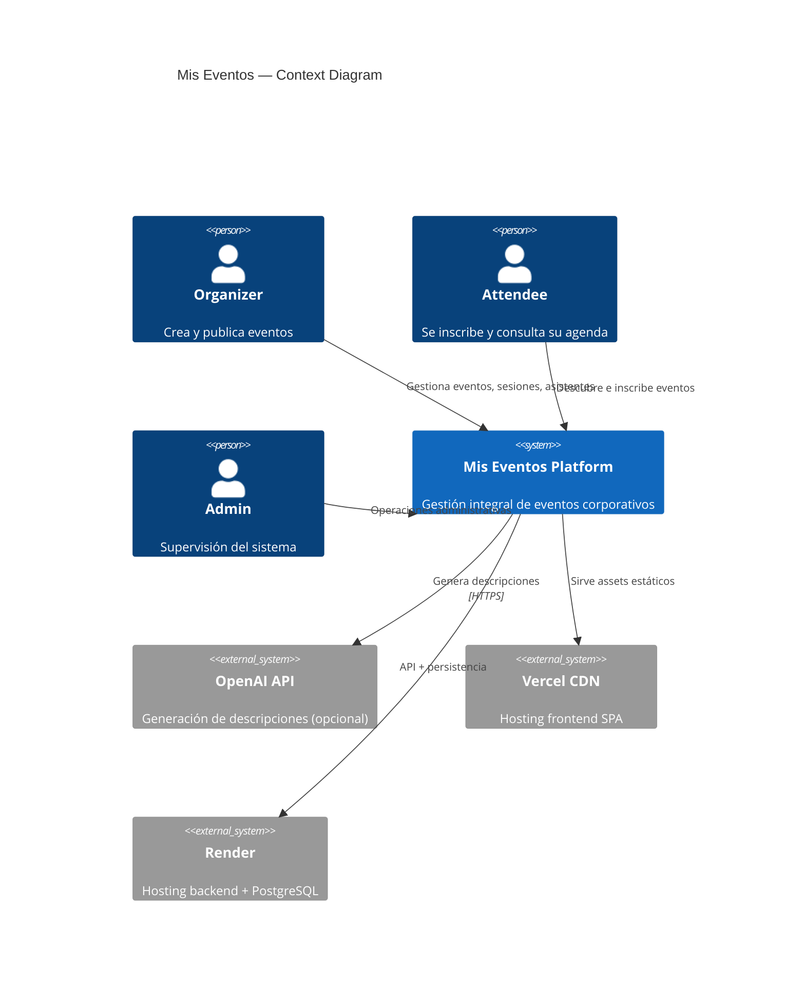
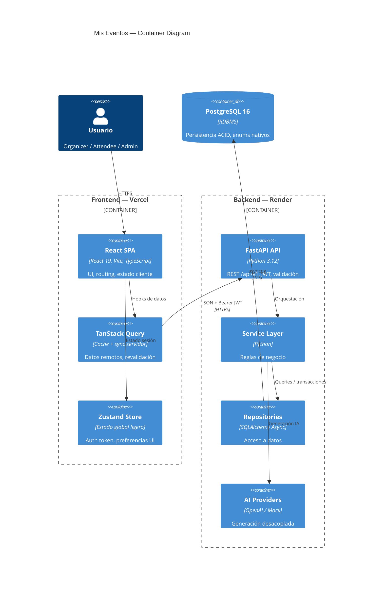
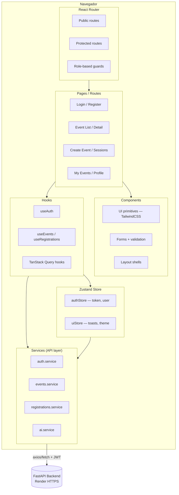
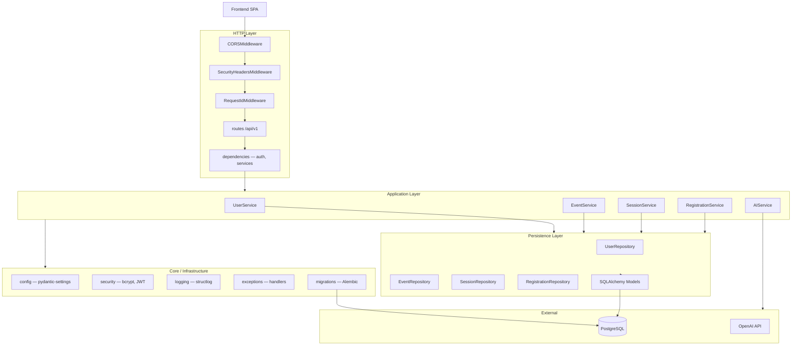
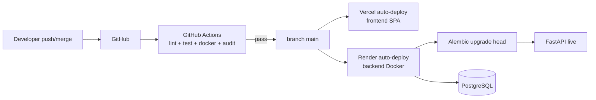
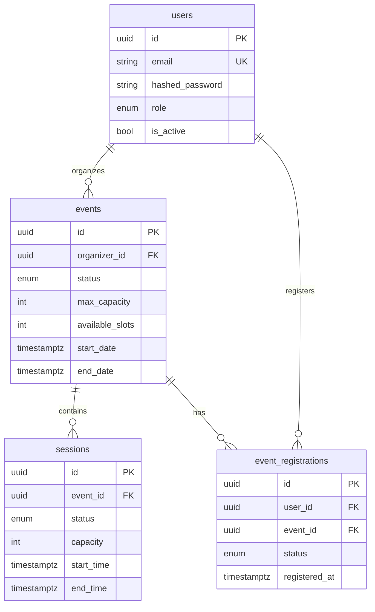

# Arquitectura — Mis Eventos

Documento de arquitectura de referencia para ingeniería, revisión técnica y evolución del producto. Describe el **sistema completo** (frontend + backend + infraestructura) tal como está desplegado en producción, con decisiones reales, trade-offs asumidos y caminos de escalado.

**Estado:** plataforma funcional en producción  
**Frontend:** [mis-eventos-web.vercel.app](https://mis-eventos-web.vercel.app)  
**Backend:** Render (FastAPI + PostgreSQL)

---

## Tabla de contenidos

1. [Introducción](#1-introducción)
2. [Visión full stack](#2-visión-full-stack)
3. [Diagramas de arquitectura (Mermaid)](#3-diagramas-de-arquitectura-mermaid)
4. [Comunicación entre capas](#4-comunicación-entre-capas)
5. [Arquitectura frontend](#5-arquitectura-frontend)
6. [Arquitectura backend](#6-arquitectura-backend)
7. [Decisiones técnicas y trade-offs](#7-decisiones-técnicas-y-trade-offs)
8. [Seguridad](#8-seguridad)
9. [CI/CD y despliegue](#9-cicd-y-despliegue)
10. [Observabilidad](#10-observabilidad)
11. [Perspectiva de líder técnico](#11-perspectiva-de-líder-técnico)
12. [Modelo de datos](#12-modelo-de-datos)
13. [Flujos representativos](#13-flujos-representativos)
14. [Evolución futura](#14-evolución-futura)

---

## 1. Introducción

**Mis Eventos** es una plataforma para planificar, publicar y operar eventos corporativos (presenciales o híbridos). Conecta tres actores del dominio:

| Actor | Rol |
|-------|-----|
| **Organizer** | Crea eventos, define sesiones, publica y consulta asistentes |
| **Attendee** | Descubre eventos, se inscribe y gestiona su agenda |
| **Admin** | Supervisión y operaciones transversales (infraestructura RBAC preparada) |

El sistema no es un CRUD genérico: incorpora reglas de negocio explícitas (estados de evento, cupos, solapamiento de sesiones, elegibilidad de inscripción), trazabilidad por `request_id`, contratos HTTP predecibles y generación asistida de contenido con IA desacoplada del dominio.

### Stack desplegado

| Capa | Tecnologías |
|------|-------------|
| **Frontend** | React 19, Vite, TypeScript, Zustand, TanStack Query, TailwindCSS, Vercel |
| **Backend** | FastAPI, SQLAlchemy 2.0 Async, PostgreSQL 16, Alembic, JWT, Structlog, Docker, Render |
| **Infraestructura** | Docker Compose (dev), GitHub Actions (CI), Vercel + Render (CD), variables de entorno 12-factor |

### Principios arquitectónicos

1. **Separación de responsabilidades** — UI, aplicación, persistencia e integraciones externas viven en capas distintas.
2. **Contratos explícitos** — Pydantic en backend, TypeScript en frontend, OpenAPI como fuente de verdad HTTP.
3. **Async end-to-end** — I/O concurrente sin bloquear el event loop en el path crítico.
4. **Paridad dev/prod** — PostgreSQL real en local, CI y producción; migraciones versionadas con Alembic.
5. **Seguridad por capas** — TLS en tránsito, bcrypt en reposo, JWT stateless, validación y sanitización en frontera.
6. **Operabilidad** — logs JSON, health checks, errores estructurados, pipeline CI desacoplado.

---

## 2. Visión full stack

Mis Eventos sigue una arquitectura **SPA + API REST versionada + RDBMS**, desplegada en PaaS cloud-native:

```
┌─────────────────────────────────────────────────────────────────────────┐
│                         USUARIO (navegador)                              │
└─────────────────────────────────┬───────────────────────────────────────┘
                                  │ HTTPS
                                  ▼
┌─────────────────────────────────────────────────────────────────────────┐
│  FRONTEND SPA — Vercel                                                   │
│  React 19 · Vite · TypeScript · TanStack Query · Zustand · TailwindCSS  │
└─────────────────────────────────┬───────────────────────────────────────┘
                                  │ HTTPS / JSON / JWT Bearer
                                  ▼
┌─────────────────────────────────────────────────────────────────────────┐
│  BACKEND API — Render (Docker)                                           │
│  FastAPI · SQLAlchemy Async · Alembic · Structlog · OpenAI (opcional)   │
└─────────────────────────────────┬───────────────────────────────────────┘
                                  │ PostgreSQL wire protocol (TLS)
                                  ▼
┌─────────────────────────────────────────────────────────────────────────┐
│  PostgreSQL 16 — Render Managed Database                                 │
│  users · events · sessions · event_registrations                         │
└─────────────────────────────────────────────────────────────────────────┘
```

**Patrón adoptado:** monolito modular en backend + SPA desacoplada en frontend. No hay BFF ni GraphQL: el frontend consume directamente `/api/v1/*`. La complejidad de negocio reside en el backend; el frontend orquesta UX, estado de cliente y caché.

---

## 3. Diagramas de arquitectura (Mermaid)

### 3.1 Context Diagram (C4 — Nivel 1)



### 3.2 Container Diagram (C4 — Nivel 2)



### 3.3 Frontend Architecture



### 3.4 Backend Architecture



---

## 4. Comunicación entre capas

### 4.1 Flujo request/response

```
1. Usuario interactúa con React (evento onClick, submit form)
2. Hook (TanStack Query mutation/query) invoca service layer
3. Service adjunta Authorization: Bearer <JWT> si hay sesión
4. HTTPS → Render → FastAPI middleware chain
5. Route valida body con Pydantic → Service ejecuta reglas → Repository persiste
6. Respuesta JSON + headers (X-Request-ID, security headers, CORS)
7. TanStack Query actualiza caché; Zustand mantiene token/usuario
8. UI re-renderiza con nuevo estado
```

### 4.2 Contrato HTTP

| Aspecto | Convención |
|---------|------------|
| **Base URL prod** | `https://mis-eventos-api-*.onrender.com/api/v1` |
| **Autenticación** | JWT Bearer en header `Authorization` |
| **Errores** | `{ "error": { "code", "message", "details?" }, "request_id" }` |
| **Paginación** | Query params `page`, `limit` en listados |
| **CORS** | Orígenes explícitos (`localhost:5173`, dominio Vercel) |
| **Correlación** | Header `X-Request-ID` (entrada o generado) |

### 4.3 Autenticación en el flujo

```
Register/Login → POST /auth/register | /auth/login
              → Backend hashea (bcrypt) / verifica / emite JWT
              → Frontend almacena token (Zustand + persistencia local)
              → Requests subsiguientes incluyen Bearer token
              → Backend decodifica JWT → carga UserRead desde PostgreSQL
```

El password **nunca** viaja almacenado en cliente más allá del formulario en memoria; en tránsito va cifrado por TLS; en servidor solo persiste hash bcrypt.

---

## 5. Arquitectura frontend

> SPA desplegada en Vercel. El frontend es consumidor del contrato OpenAPI del backend; no contiene reglas de negocio críticas.

### 5.1 Capas y responsabilidades

| Capa | Responsabilidad | Tecnología |
|------|-----------------|------------|
| **Pages** | Composición de pantallas, carga de datos, navegación | React 19 + React Router |
| **Components** | UI reutilizable, formularios, feedback visual | TailwindCSS, componentes propios |
| **Layouts** | Shells (`MainLayout`, `AuthLayout`), navbar, guards | Layout components |
| **Hooks** | Lógica reutilizable, binding Query ↔ UI | Custom hooks + TanStack Query |
| **Services** | Cliente HTTP tipado por dominio (auth, events, AI) | fetch/axios, mapeo DTOs |
| **Store** | Estado global mínimo (sesión, UI efímera) | Zustand |
| **Routing** | Rutas públicas/protegidas, lazy loading | React Router v6+ |

### 5.2 Routing y protección

```
/                    → Landing o redirect
/login, /register    → Rutas públicas (AuthLayout)
/events              → Listado público / autenticado
/events/:id          → Detalle + inscripción
/events/new          → Crear evento (organizer, protegido)
/me/events           → Mis inscripciones (protegido)
```

Los **route guards** leen el token desde Zustand; si expira o es inválido (401), redirigen a login y limpian caché de Query.

### 5.3 Gestión de estado — división deliberada

| Tipo de estado | Dónde vive | Ejemplo |
|----------------|------------|---------|
| **Servidor** | TanStack Query | Listado de eventos, detalle, asistentes |
| **Sesión global** | Zustand | JWT, usuario autenticado |
| **UI local** | useState / Zustand UI slice | Modales, toasts, form drafts |
| **URL** | React Router | Filtros, IDs de recurso |

Esta separación evita duplicar en Redux datos que TanStack Query ya cachea, sincroniza y revalida.

### 5.4 Services layer (frontend)

Cada dominio expone funciones tipadas que el hook consume:

```typescript
// Patrón representativo
authService.login(credentials)      → POST /auth/login
eventsService.list(params)          → GET  /events
eventsService.create(payload)       → POST /events
registrationsService.register(id)   → POST /events/{id}/register
aiService.generateDescription(ctx)  → POST /ai/generate-event-description
```

Los services centralizan: base URL desde env (`VITE_API_URL`), interceptores JWT, mapeo de errores `{ error.code }` a mensajes UX.

### 5.5 Build y deploy (Vercel)

```
git push → GitHub → Vercel build (vite build) → CDN edge
Variables: VITE_API_URL, VITE_* → inyectadas en build time
Preview deployments por PR; production en merge a main
```

---

## 6. Arquitectura backend

Monolito modular async con **Clean Architecture pragmática**: dependencias apuntan hacia el dominio; HTTP no conoce SQL.

### 6.1 Estructura de capas

```
app/
├── api/v1/
│   ├── routes/          # Endpoints HTTP delgados
│   ├── dependencies/    # Inyección: DbSession, CurrentUser, services
│   └── router.py        # Composición /api/v1
├── services/            # Reglas de negocio y orquestación
├── repositories/        # Acceso a datos (SQLAlchemy 2.0)
├── models/              # ORM — estado persistido
├── schemas/             # Pydantic — contratos HTTP
├── providers/ai/        # Adaptadores OpenAI / Mock
├── utils/               # Reglas puras sin I/O
├── core/                # Config, DB, security, logging, middleware, migrations
└── main.py              # Factory FastAPI, lifespan, handlers
```

**Regla de dependencia:** `routes → services → repositories → models`. Los repositorios no importan FastAPI. Los providers solo los invocan servicios.

### 6.2 Routers y endpoints (v1)

| Módulo | Prefijo | Responsabilidad |
|--------|---------|-----------------|
| `auth` | `/auth` | Register, login, `/me` |
| `events` | `/events` | CRUD eventos, estados, cupos |
| `event_sessions` | `/events/{id}/sessions` | Sesiones anidadas |
| `sessions` | `/sessions` | Detalle/actualización sesión |
| `event_registrations` | `/events/{id}/register` | Inscripción / cancelación |
| `me_events` | `/me/events` | Agenda del asistente |
| `ai` | `/ai` | Generación descripciones |
| `health` | `/health` | Readiness con `SELECT 1` |

### 6.3 Service layer

| Servicio | Responsabilidades |
|----------|-------------------|
| `UserService` | Registro, login JWT, perfil; mensajes anti-enumeración |
| `EventService` | CRUD, transiciones de estado, publicación |
| `SessionService` | Agenda, solapamientos, capacidad por sesión |
| `RegistrationService` | Inscripciones, cupos, idempotencia, elegibilidad |
| `AIService` | Orquestación IA, rate limit, fallback a mock |

### 6.4 Repositories

Encapsulan **cómo** se lee/escribe la BD, no **si** una operación es válida:

```python
# Correcto
await event_repository.get_by_id_for_update(event_id)

# Incorrecto — regla de negocio en repositorio
# if event.status == FINISHED: raise ...
```

Soportan `SELECT ... FOR UPDATE` en operaciones de cupos para consistencia bajo concurrencia.

### 6.5 Schemas vs Models

| Capa | Rol |
|------|-----|
| **Schemas (Pydantic)** | Contratos HTTP: validación entrada, DTOs salida, sin campos internos |
| **Models (SQLAlchemy)** | Persistencia: relaciones, constraints, enums PostgreSQL nativos |

`UserRead` nunca expone `hashed_password`. `UserCreate` aplica política de contraseñas en frontera.

### 6.6 Middleware chain (orden de ejecución)

```
Request → CORSMiddleware → SecurityHeadersMiddleware → RequestIdMiddleware → Route
```

| Middleware | Función |
|------------|---------|
| **CORS** | Orígenes explícitos, credentials, expone `X-Request-ID` |
| **SecurityHeaders** | `X-Content-Type-Options`, `X-Frame-Options`, `HSTS`, `Referrer-Policy` |
| **RequestId** | Correlación logs ↔ respuesta HTTP |

### 6.7 Auth y dependencias

```python
CurrentUser     # JWT → UUID → UserRead activo desde BD
require_roles() # RBAC: admin | organizer | attendee (infraestructura lista)
UserServiceDep  # Servicio con AsyncSession inyectada
```

Flujo JWT: login verifica bcrypt → emite token HS256 con claims `sub`, `role`, `type=access` → rutas protegidas decodifican y **revalidan usuario en BD** (no confían ciegamente en el token).

### 6.8 Logging

Structlog con salida JSON en producción:

- Processor de **redacción** de campos sensibles (`password`, `token`, `api_key`)
- Context vars: `request_id`, `method`, `path`
- Eventos de dominio: `registration_created`, `ai_provider_fallback`, etc.

### 6.9 Migraciones y arranque en producción

```
scripts/start-production.sh:
  alembic upgrade head  →  uvicorn (2 workers)

lifespan (main.py):
  apply_pending_migrations() con advisory lock PostgreSQL (multi-worker safe)
```

Doble garantía: script de entrypoint + hook de lifespan en `production`/`staging`.

---

## 7. Decisiones técnicas y trade-offs

Cada decisión incluye **por qué se eligió**, ventajas, desventajas y coste asumido.

### 7.1 FastAPI vs Django (DRF)

| | FastAPI ✅ | Django |
|---|-----------|--------|
| **Ventajas** | Async nativo, OpenAPI automático, Pydantic integrado, alto throughput I/O | Admin, ORM maduro, ecosistema enorme, convenciones fuertes |
| **Desventajas** | Menos baterías incluidas; convenciones de equipo a definir | Stack mayormente síncrono; async menos idiomático para APIs greenfield |
| **Por qué FastAPI** | Dominio I/O-bound (DB + OpenAI), contrato OpenAPI como puente con frontend TS, tipado end-to-end | — |

### 7.2 Zustand vs Redux Toolkit

| | Zustand ✅ | Redux |
|---|-----------|-------|
| **Ventajas** | API mínima, sin boilerplate, bundle pequeño, suficiente para auth + UI | DevTools potentes, ecosistema middleware, predecible en apps muy grandes |
| **Desventajas** | Menos tooling de time-travel; disciplina manual en equipos grandes | Verboso; overkill cuando TanStack Query ya gestiona estado servidor |
| **Por qué Zustand** | El 80% del estado remoto vive en TanStack Query; solo se necesita store global ligero para sesión | — |

### 7.3 TanStack Query vs fetch manual

| | TanStack Query ✅ | fetch/useEffect manual |
|---|------------------|------------------------|
| **Ventajas** | Caché, deduplicación, revalidación, estados loading/error, retries | Cero dependencias, control total |
| **Desventajas** | Curva de aprendizaje; configuración de staleTime/queryKeys | Reimplementar caché, race conditions, loading states en cada pantalla |
| **Por qué TanStack Query** | Listados de eventos, detalle, inscripciones se benefician de caché y sync; menos bugs de consistencia UI | — |

### 7.4 Render + Vercel vs AWS (ECS/RDS/CloudFront)

| | Render + Vercel ✅ | AWS full |
|---|-------------------|----------|
| **Ventajas** | Deploy en minutos, HTTPS gratis, CI/CD simple, coste inicial bajo, DX excelente para MVPs/productos pequeños | Control total, escala masiva, multi-región, compliance enterprise |
| **Desventajas** | Cold starts (Render free/starter), menos knobs de infra, vendor lock-in moderado | Complejidad operativa, coste de tiempo de equipo, over-engineering para etapa actual |
| **Por qué PaaS** | Producto funcional desplegado con equipo reducido; foco en dominio, no en Terraform | — |

### 7.5 PostgreSQL vs SQLite

| | PostgreSQL ✅ | SQLite |
|---|--------------|--------|
| **Ventajas** | ACID real, enums nativos, concurrencia write, mismo motor prod/dev/CI | Cero setup, velocidad en tests unitarios |
| **Desventajas** | Requiere instancia (Docker/Render) | Semántica distinta → falsos positivos en constraints y locks |
| **Por qué PostgreSQL** | GitHub Actions usa service container Postgres 16; integración tests con paridad total | — |

### 7.6 SQLAlchemy Async vs sync

| | Async ✅ | Sync |
|---|---------|------|
| **Ventajas** | Coherencia con FastAPI + asyncpg; mejor concurrencia I/O | Modelo mental más simple |
| **Desventajas** | Disciplina en tests (`pytest-asyncio`); debugging concurrencia | Mezclar sync ORM + async FastAPI → `run_in_executor` y deuda |

### 7.7 Repository + Service vs Fat Models / Active Record

| | Repository + Service ✅ | Fat Models |
|---|------------------------|------------|
| **Ventajas** | Testabilidad (mock repos), queries reutilizables, reglas centralizadas en services | Menos archivos, velocidad inicial |
| **Desventajas** | Más capas, boilerplate | Acopla HTTP/negocio/persistencia; difícil de testear |

### 7.8 Dockerized deployment

| **Ventajas** | **Desventajas** |
|--------------|-----------------|
| Paridad dev/prod, builds reproducibles, usuario non-root en imagen production | Overhead en dev sin Docker; curva inicial |
| Multi-stage Dockerfile (`development` \| `production`) | No sustituye orquestación K8s a escala |

**Por qué Docker:** Render consume imagen con healthcheck; CI valida build en cada PR (`docker-validation.yml`).

### 7.9 JWT stateless vs sessions server-side

| | JWT ✅ | Session cookie + Redis |
|---|-------|------------------------|
| **Ventajas** | API stateless, escala horizontal simple | Revocación inmediata, logout real |
| **Desventajas** | Sin revocación instantánea sin blacklist/refresh rotativo | Estado en servidor, sticky sessions o store compartido |

**Evolución documentada:** refresh tokens rotativos + denylist Redis cuando el producto lo exija.

### 7.10 bcrypt nativo vs passlib

| | bcrypt directo ✅ | passlib |
|---|------------------|---------|
| **Ventajas** | Compatible con bcrypt 4.x+, sin dependencia abandonada, menos capas | API unificada multi-algoritmo |
| **Desventajas** | Solo bcrypt (suficiente para el dominio) | Incompatibilidades con bcrypt ≥4.1 en producción |

---

## 8. Seguridad

Defensa en profundidad: transporte, autenticación, validación, respuesta y observabilidad.

### 8.1 Modelo de amenazas (resumen)

| Vector | Mitigación implementada |
|--------|-------------------------|
| Intercepción de credenciales | HTTPS/TLS (Vercel + Render); sin cifrado manual en cliente |
| Password en reposo | bcrypt (12 rounds), salting automático, nunca plaintext |
| Token robado | Expiración JWT (`exp`); revalidación usuario activo en BD |
| XSS → robo de token | HttpOnly no aplica (Bearer en memoria/localStorage); mitigación: CSP futuro en frontend, sanitización |
| CSRF en API | JWT Bearer (no cookies de sesión) → CSRF no aplicable al patrón actual |
| CORS abuse | Lista explícita de orígenes; `allow_credentials=True` solo para orígenes confiables |
| User enumeration | Mensajes genéricos en login/registro duplicado |
| Filtración en errores | Validación sanitizada sin `input`; redacción en logs |
| Headers de hardening | `X-Content-Type-Options`, `X-Frame-Options`, `HSTS`, `Referrer-Policy` |

### 8.2 Autenticación JWT

```
Algoritmo:    HS256
Secret:       SECRET_KEY (mín. 32 chars, env var)
Claims:       sub (UUID), role, type=access, iat, exp
TTL:          ACCESS_TOKEN_EXPIRE_MINUTES (default 30)
```

### 8.3 Password policy

- Mínimo 8 caracteres; mayúscula, minúscula, dígito, especial (`!@#$%^&*._-`)
- Validación en `UserCreate` (Pydantic + `password_policy.py`)
- Hash con `bcrypt.gensalt(12)` + `hashpw`; verify con `checkpw`

### 8.4 HTTPS / TLS

```
Frontend (Vercel) ──TLS 1.2+──► Backend (Render) ──TLS──► PostgreSQL (Render)
```

Las contraseñas viajan cifradas en tránsito. **No** se implementa AES/RSA en frontend: TLS es la capa correcta para confidencialidad en tránsito.

### 8.5 CORS

```python
allow_origins = [
    "http://localhost:5173",
    "https://mis-eventos-web.vercel.app",
]
allow_credentials = True
expose_headers = ["X-Request-ID"]
```

Configuración explícita por entorno (`CORS_ORIGINS` JSON en variables Render).

### 8.6 Validación y sanitización

| Mecanismo | Ubicación | Función |
|-----------|-----------|---------|
| Pydantic v2 | `schemas/` | Validación tipada en frontera HTTP |
| `sanitize_validation_errors` | `utils/validation_errors.py` | Errores 422 sin `input` ni datos sensibles |
| `redact_sensitive_event` | `utils/sensitive_data.py` + structlog | Logs sin passwords/tokens |
| `text_sanitize` | `utils/text_sanitize.py` | Sanitización inputs IA |

Formato de error enterprise:

```json
{
  "error": {
    "code": "validation_error",
    "message": "Request validation failed",
    "details": [{ "field": "password", "message": "Password format invalid" }]
  },
  "request_id": "uuid"
}
```

### 8.7 Secretos y configuración

- 12-factor: toda config vía variables de entorno
- `.env` en `.gitignore`; `.env.example` sin secretos reales
- CI usa claves de prueba dedicadas (`SECRET_KEY` de test en workflows)

---

## 9. CI/CD y despliegue

### 9.1 Pipeline GitHub Actions

Tres workflows **desacoplados** (fallos localizables, paralelizables):

| Workflow | Trigger | Jobs |
|----------|---------|------|
| **Backend CI** | push/PR `app/**`, `alembic/**` | Lint (Ruff + Black) → Tests (PostgreSQL service) → Coverage ≥50% |
| **Docker Validation** | push/PR `Dockerfile`, compose | Build imagen production → smoke test `/health` |
| **Security Checks** | push/PR + cron semanal | `pip-audit` dependencias |

Características transversales:

- `concurrency` con cancel-in-progress (evita runs redundantes)
- Composite action `setup-backend` (uv + caché determinista)
- Artefactos de cobertura HTML/XML

### 9.2 Flujo de despliegue



### 9.3 Render (backend)

```
Build:   Dockerfile target production
Start:   scripts/start-production.sh
         → alembic upgrade head
         → uvicorn --workers 2
Health:  GET /health (Docker HEALTHCHECK)
Env:     DATABASE_URL, SECRET_KEY, ENVIRONMENT=production,
         CORS_ORIGINS, AI_PROVIDER, OPENAI_API_KEY
```

### 9.4 Vercel (frontend)

```
Build:   vite build
Env:     VITE_API_URL → URL Render
Deploy:  Automático en push a main; preview por PR
CDN:     Edge global, HTTPS automático
```

---

## 10. Observabilidad

### 10.1 Logging estructurado

Con `LOG_JSON=true` (default producción):

```json
{
  "event": "request_completed",
  "request_id": "550e8400-e29b-41d4-a716-446655440000",
  "method": "POST",
  "path": "/api/v1/auth/register",
  "status_code": 201,
  "duration_ms": 87.3,
  "level": "info",
  "timestamp": "2026-05-24T21:00:00.000Z"
}
```

Processors: context vars, redacción sensibles, stack traces en errores 500 (solo server-side).

### 10.2 Request tracing

`RequestIdMiddleware`:

1. Acepta `X-Request-ID` entrante o genera UUID
2. Enlaza a Structlog context vars
3. Devuelve header en respuesta
4. Incluye `request_id` en payload de error JSON

Correlación: log Render ↔ respuesta frontend ↔ reporte de usuario.

### 10.3 Health checks

| Endpoint | Tipo | Comportamiento |
|----------|------|----------------|
| `GET /health` | Liveness | Proceso vivo; sin tocar BD |
| `GET /api/v1/health` | Readiness | Incluye `SELECT 1` a PostgreSQL |

Docker `HEALTHCHECK` y Render usan liveness para reinicio automático.

### 10.4 Manejo de errores

Jerarquía centralizada en `app/core/exceptions.py`:

| Handler | Código HTTP | Cuándo |
|---------|-------------|--------|
| `AppException` | 4xx/5xx según dominio | Reglas de negocio |
| `RequestValidationError` | 422 | Input inválido (sanitizado) |
| `StarletteHTTPException` | variable | HTTP estándar |
| `Exception` | 500 | Fallback; mensaje genérico al cliente, stack en log |

**Principio:** el cliente recibe mensajes accionables; el servidor registra detalle completo sin filtrar secretos al response.

---

## 11. Perspectiva de líder técnico

### 11.1 Mantenibilidad

| Práctica | Impacto |
|----------|---------|
| Capas con reglas de dependencia claras | Onboarding predecible; cambios localizados |
| OpenAPI + TypeScript | Contrato vivo entre equipos frontend/backend |
| Migraciones Alembic versionadas | Evolución de esquema auditable y reversible |
| Tests integración con PostgreSQL real | Regresiones de constraints detectadas antes de prod |
| Lint/format en CI (Ruff + Black) | Estilo uniforme sin debates en PR |

### 11.2 Escalabilidad

| Dimensión | Estado actual | Palanca de crecimiento |
|-----------|---------------|------------------------|
| **API** | Stateless JWT, 2 workers Uvicorn | Réplicas Render + load balancer |
| **BD** | Pool 10 + overflow 20 | PgBouncer, read replicas |
| **IA rate limit** | In-memory por proceso | Redis sliding window |
| **Frontend** | CDN Vercel edge | Ya escalado horizontalmente |
| **Caché** | No implementado | Redis para listados públicos |

### 11.3 Modularidad y bounded contexts

Límites naturales ya dibujados en código:

```
Auth/Users     →  UserService, auth routes
Events         →  EventService, event routes
Sessions       →  SessionService, session routes
Registrations  →  RegistrationService
AI             →  AIService + providers/ (extraíble a microservicio)
```

Extraer IA o notificaciones a servicios independientes no requiere reescribir el dominio — solo mover adaptadores y contratos.

### 11.4 Separación de responsabilidades — checklist

| Pregunta | Respuesta en Mis Eventos |
|----------|--------------------------|
| ¿La ruta contiene SQL? | No — delega a service |
| ¿El servicio conoce HTTP status? | No — lanza `AppException` con código |
| ¿El repositorio valida cupos? | No — `RegistrationService` |
| ¿El frontend calcula cupos? | No — muestra lo que la API devuelve |
| ¿La IA acopla el dominio eventos? | No — provider inyectado vía factory |

### 11.5 Deuda técnica consciente

| Item | Riesgo | Plan |
|------|--------|------|
| JWT sin refresh/revocación | Token robado válido hasta exp | Refresh rotativo + denylist |
| Rate limit IA en memoria | Incorrecto multi-réplica | Redis |
| HS256 simétrico | Rotación de claves más delicada en multi-servicio | RS256/JWKS |
| Fallback IA a mock silencioso | Calidad inconsistente | Campo `provider_used` en response |

---

## 12. Modelo de datos



| Entidad | Decisiones de diseño |
|---------|---------------------|
| `users` | UUID PK, email único, enum `user_role` nativo PostgreSQL |
| `events` | Máquina de estados (`draft` → `published` → `finished`/`cancelled`), cupos denormalizados |
| `sessions` | Ventana temporal, constraints de solapamiento en servicio |
| `event_registrations` | Índice único parcial `(user_id, event_id) WHERE status='registered'` |

---

## 13. Flujos representativos

### 13.1 Registro de usuario e inscripción a evento

```
Attendee → POST /auth/register (password validado, bcrypt hash)
        → POST /auth/login → JWT
        → GET  /events (TanStack Query cache)
        → POST /events/{id}/register
              RegistrationService:
                - evento published
                - cupos disponibles
                - no auto-inscripción del organizer
                - idempotente si ya inscrito
        → 201 + available_slots decrementado
```

### 13.2 Publicación de evento (organizer)

```
Organizer → POST /events (draft | published)
         → POST /events/{id}/sessions (opcional)
         → PUT  /events/{id} { status: published }
              EventService valida transiciones (event_rules)
         → Evento visible en listado frontend
```

### 13.3 Generación IA de descripción

```
Organizer → POST /ai/generate-event-description + Bearer
         → AIService: rate limit → OpenAIProvider
         → (fallo red) → fallback MockAIProvider
         → 200 + generated_description
         → Frontend pre-rellena formulario de evento
```

---

## 14. Evolución futura

| Horizonte | Iniciativa |
|-----------|------------|
| **Corto** | Refresh tokens, CSP en frontend, campo `provider_used` en IA |
| **Medio** | Redis (rate limit + caché listados), notificaciones email, refresh token rotation |
| **Largo** | `/api/v2` si breaking changes, extracción servicio IA, read replicas PostgreSQL |

### API versionado

- Prefijo actual: `/api/v1`
- Breaking changes → router `/api/v2` paralelo; deprecación documentada de v1

### Microservicios (readiness, no obligación)

Cortes naturales ya identificados: `providers/ai/`, futuro módulo de notificaciones, búsqueda full-text externa.

---

## Referencias internas

| Recurso | Ubicación |
|---------|-----------|
| Setup y comandos | [README.md](README.md) |
| Uso responsable de IA | [AI_USAGE.md](AI_USAGE.md) |
| Workflows CI | [.github/workflows/](.github/workflows/) |
| Configuración tipada | `app/core/config.py` |
| Contrato de errores | `app/core/exceptions.py` |
| Seguridad auth | `app/core/security.py` |
| Migraciones | `alembic/versions/` |

---

*Documento mantenido por el equipo de Mis Eventos. Última revisión alineada con despliegue producción Render + Vercel.*
